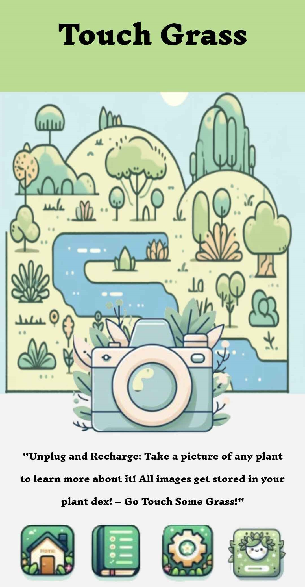

# PlantDex

Created by Artemis Tran, Sonya Hu, and Rohan Sinha for LA Hacks

## Overview

Welcome to PlantDex! PlantDex is an Android app built with React Native that focuses on the theme of sustainability and treating nature with respect! The basic idea is for the user to take pictures and log any type of plants they come across while they're outside, which is then saved to a gallery. Then, our app would analyze the photo and then identify the type of plant it is alongside some basic information, such as the date captured and description.

## Current Features

* Camera that allows users to take pictures of plants. 
    * This is implemented through Expo Go and their expo-camera component
* Gallery that saves the pictures taken to local storage and in the app

 ## To-Do

* Create individual user accounts
* AI that correctly identifies the plant and provides basic information
* Integrate a database that saves the pictures for each user

## Installation

Clone the project by the following command:

`git clone git@github.com:Artemis-Tran/plant-dex.git`

Install all the needed dependencies

To run the application, use:

`npx start --tunnel`

and use the Expo Go app to scan the QR code
